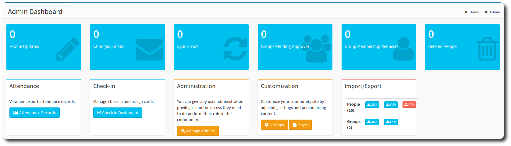
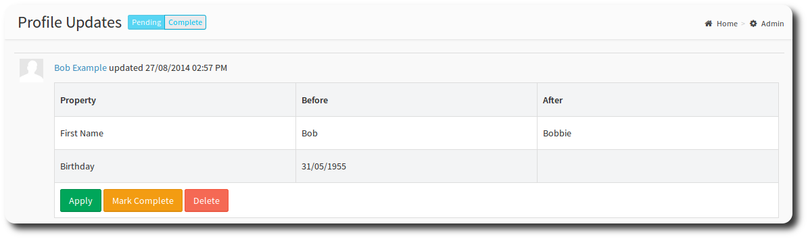
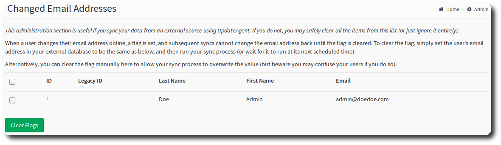
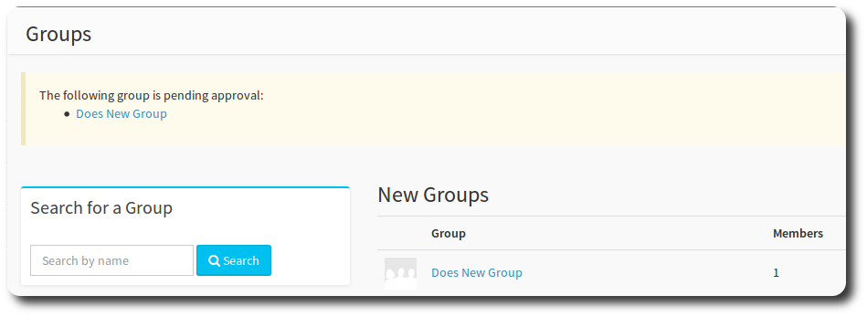
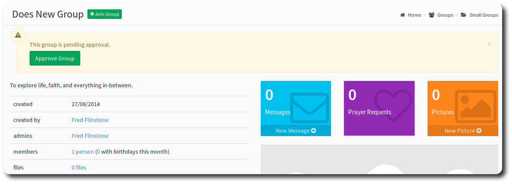
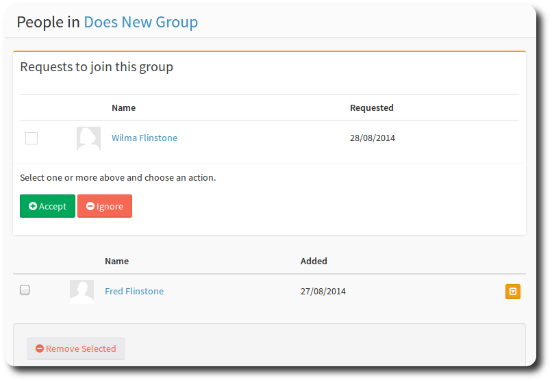

# the Admin Dashboard

The admin dashboard is the control centre for your application. From here, you can set members up as administrators, control group access, and import and export people records.

> **Caution** Contains settings that could harm OneBody, so tread with caution. Enough said!

### Profile Updates

If you require administrator approval for personal information updates, you'll need to come to this screen to approve them.

Use the Pending | Complete switch to toggle between types of updates.

* **Apply** will apply the update to the person.
* **Mark Complete** will mark the update as complete, so it no longer appears in the pending listing.
* **Delete** will delete the update. This is useful if a member has multiple updates and this is not the latest data update to be applied.

### Changed Emails

This administration section is useful if you sync your data from an external source using UpdateAgent. If you do not, you may safely clear all the items from this list (or just ignore it entirely).

When a user changes their email address online, a flag is set, and subsequent syncs cannot change the email address back until the flag is cleared. To clear the flag, simply set the user's email address in your external database to be the same as below, and then run your sync process (or wait for it to run at its next scheduled time).

Alternatively, you can clear the flag manually here to allow your sync process to overwrite the value (but beware you may confuse your users if you do so).

### Groups Pending Approval

OneBody's group approval process requires an administrator to approve the group prior to members joining the group. Access the group approval screen to approve groups.

Select the group you wish to approve, review the group details, and hit the *Approve Group* button. You're done!

### Group Membership Requests

If you set up your group to *approval required for people to join group* on the Group Security page of the Group Setup, a group admininistrator will need to approve new membership requests to the group.

Anyone with a group administrator permission is able to approve members to join the group. See [Managing Admins](../administration/managing_admins.html) for details on setting permissions.

At the Group Membership Requests page, select the request button for the group you want. Hitting **Accept** will allow the member to join the group. You can remove a request by hitting the **ignore** button.

    what do you call the blue boxes at the top of the screen (buttons?)
    what's the purpose of the mark complete in the personal data updates section?

