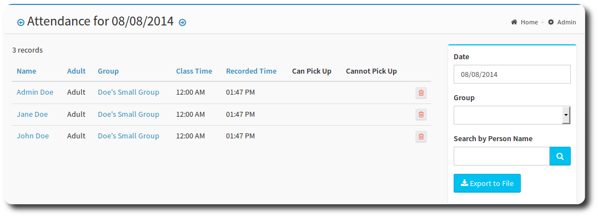

# Attendance

The attendance page allows you to administer attendance records for groups. Using this page, you can:

* find records using various filters
* remove attendance records



| Field | Description |
| -- | -- |
| Date  | Enter the date that you wish to find. This is a required field. |
| Group | Optionally, enter a group to restrict your search. |
| Person Name | Enter a name, or part of a name to find attendees. |
| Class Time | The time the group or class was due to start? |
| Recorded Time | The time the attendance record was created. |

Blue text on the headings indicates that column is sortable.

You can export the details of the screen using the Export to File button. This will create a csv file of the selected attendance records.

Use the trash icon to remove a record. You will be prompted to confirm.


```
Need to define what class time,  Can Pick Up and cannot pick up are used for.
```

