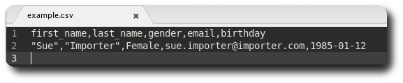
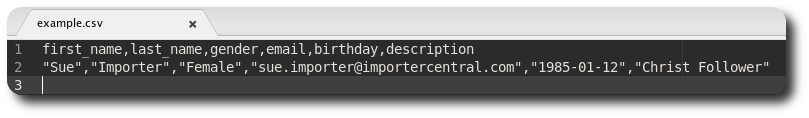
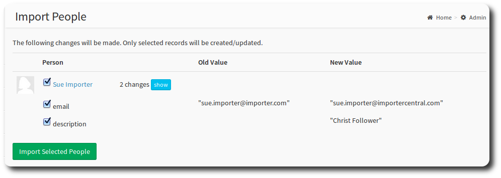

# Import & Export

OneBody provides a facility to import and export files of group and people information. You can import a file of people, and export files of people and groups.

## Export
You can download in XML (eXtensible Markup Language) or CSV format. If you're unsure, select CSV.

From the admin dashboard, select which file you would like to download. That's it!

## Import
Importing is particularly useful if you are uploading a file of details for the first time. Ongoing, the import process can be used to synchronise data from another system.

Before delving further into the import process, its useful to understand some related concepts.

#### The Import File
Import supports CSV only. Excel documents can be exported as CSV from the File => Save As menu.

**Header Row**

Your file should be formatted with a header row and then detail rows underneath. For a full list of available fields , select the hyperlink on the first line of the *Import People* page. This list is built dynamically from the OneBody database, so we've shown an example list here for illustration purposes.

* first_name
* last_name
* suffix
* gender
* mobile_phone
* work_phone
* fax
* birthday
* anniversary

In your header row, you should list the fields you want to import, separated by commas, with no spaces, eg:

first_name,last_name,gender,email,birthday

**Detail Rows**

Underneath the header row, list your data. Following the above example:
"Sue","Importer",Female,sue.importer@importer.com,1985-01-12

So you'll eventually wind up with:

* If the fields you wish to import contain commas, wrap the text in double quotation marks eg:
"Last week, we went to the movies".
* Dates are formatted YYYY-MM-DD.

#### Required File Fields

The minimum required fields to create a person record are first name and last name. We would recommend adding a date of birth if you have it, as this will improve the matching process.

#### Setting Visibility/Access

The **visibility/access** section indicates the defaults the member will be created with. See [looking after people](../administration/looking_after_people.html) for more on the meaning of the checkboxes.

## Importing a File - New people

Upload your file using the browse dialog. Choose Visibility/Access options and select Import Data to continue.

 A confirmation screen will appear confirming the newly imported records.

## Importing a File - Existing People

If you've got existing people in your database, you can configure OneBody to match and update a person's data, rather than create a new record (and therefore, avoid duplicate people records.)

If the **attempt to match existing records by name** check box is selected, OneBody will perform two match attempts:

1. first name, last name and birthday
2. first name and last name

You can also add additional fields or remove fields that you have previously imported.

In our example for Sue Importer, say we needed to update her email address and add a description. Our file now looks like:

We'll re-run the same import, but with the  **attempt to match existing records by name** flag selected.

You'll notice that instead of creating new records, we have matched to Sue Importer, and we're going to update her email address and description fields. You can also selectively update details (say select description but not email address).

> **note** Toggle "show" to see the field detail.

Make your selections and hit "Import Selected People" to complete the process.

The match on name is case insensitive, so "sue importer" would match to our example of "Sue Importer". However, in this scenario OneBody would also update the name to lowercase, so be careful!

> **hint** Schedule imports to run regularly (eg. nightly) using the [UpdateAgent]((https://github.com/churchio/onebody-updateagent).

