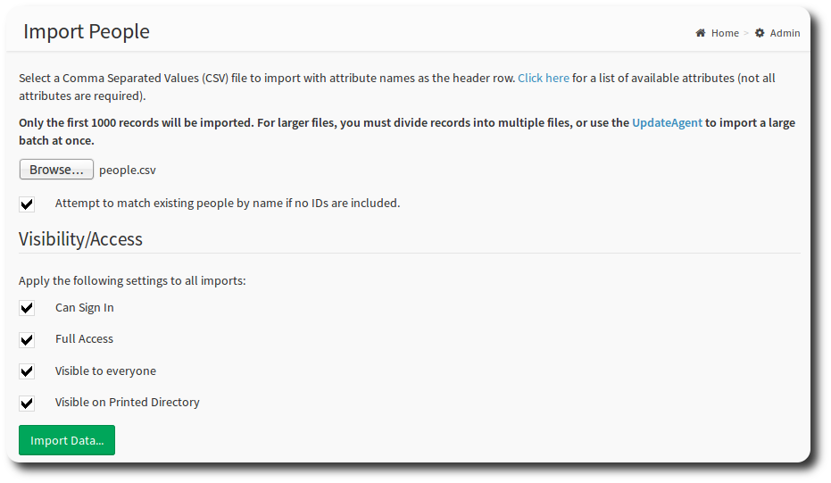
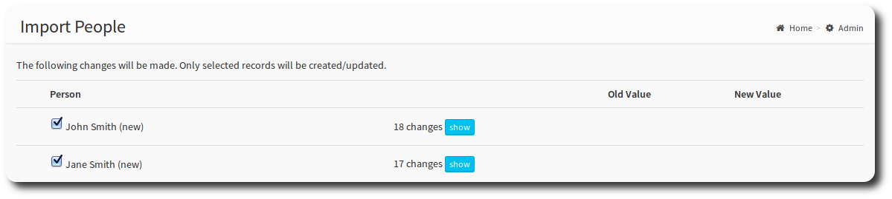

# Import & Export

OneBody provides a facility to upload and download files of group and people information. You can upload a file of people, and download files of people and groups.

## Export
You can download in XML (eXtensible Markup Language) or CSV format. If you're unsure, select CSV.

From the admin dashboard, select which file you would like to download. That's it!

## Import
Importing is particularly useful if you are synchronising data from another system or uploading a file of details for the first time. Import supports CSV only.

> Excel documents can be exported as CSV from the File -> Save As menu. Make sure to omit any header rows.

Upload your file using the browse dialog.

> **info** For files over 1000 records, use the Update Agent, or upload multiple files.

If the **attempt to match existing records by name** check box is selected, OneBody will search the last and first name fields for a match. If one is found the record will not be selected to be imported.

The **visibility/access** section indicates the defaults the member will be created with. See [looking after people](../administration/looking_after_people.html) for more.

To schedule imports to run regularly (eg. nightly) use the [UpdateAgent](](https://github.com/churchio/onebody-updateagent).

Select Import Selected People to complete the import process. A confirmation screen will appear confirming the newly imported records.

> **info** OneBody will update the existing record if it finds a match on email address.
