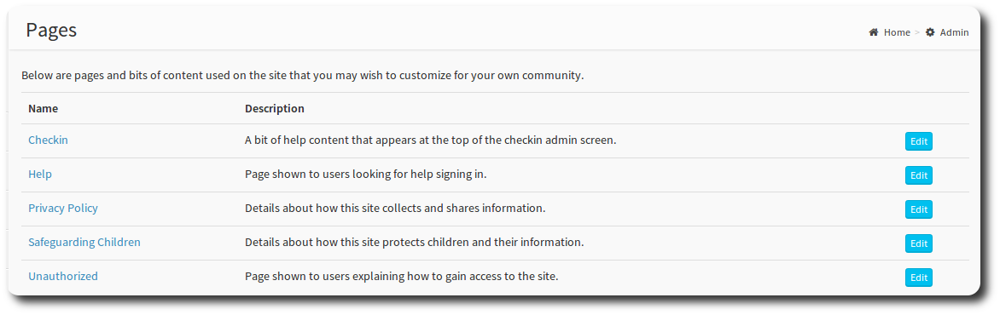
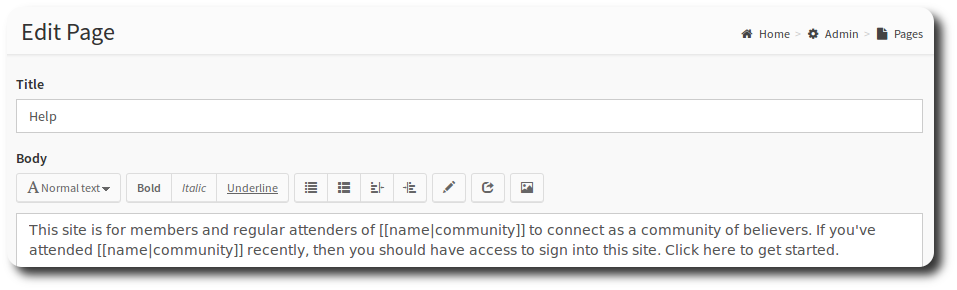

# Pages

OneBody ships with a boilerplate text for static pages on your site. Select the *Pages* button from the administration dashboard to access the pages you can update.

You can update these pages within OneBody using the provided in-place text editor. Select the article that you want to update by clicking the name.

    Do the [] variables in the content contain interpolations from the database or are they just placeholders?

