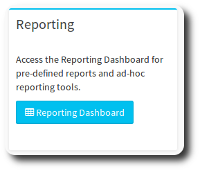
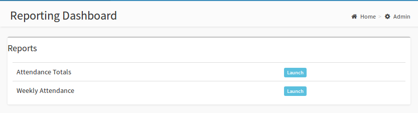

# Reporting

The Reporting Dashboard allows you to access various reports built on OneBody data. In order to see the reporting pagelet, a user must have the "Run Reports" flag set in the Administrators page, or be a Super Admin.

You can find the reporting pagelet on the admin dashboard:

From here, you arrive at the Reporting Dashboard - which will allow you to run the reports.

The tables below give a brief summary of each reports purpose and function.

|Report:| Attendance Totals |
| -- | -- |
| Designed to | Provide a count of attendees at groups for a particular date range  |
| Required Parameters | From Date, Through Date |
| Special Notes | None |

---

| Report: | Weekly Attendance Detail |
| -- | -- |
| Designed to | Provide a listing of those members who attended groups, and those who missed attendace, for a date range |
| Required Parameters | From Date, Through Date |
| Optional Parameters | Group Type, Attendance Type (Attended Only, or All - All includes misses) |
| Special Notes | Report assumes that we are only interested in the current members of the group to report "misses". Reporting historical "misses" is not advised, as the group composition is only known at the current date.|
