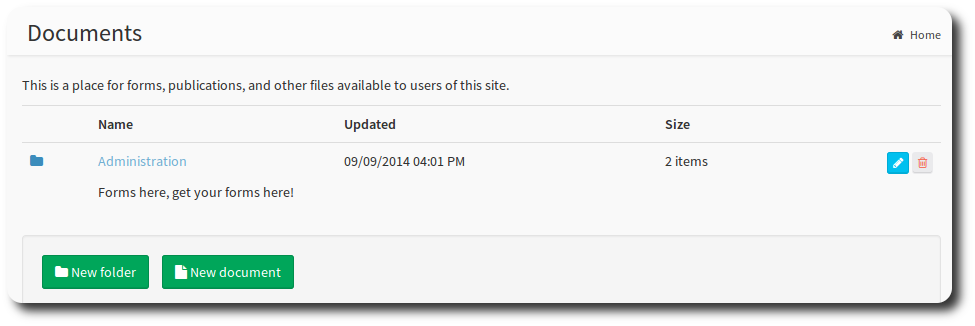
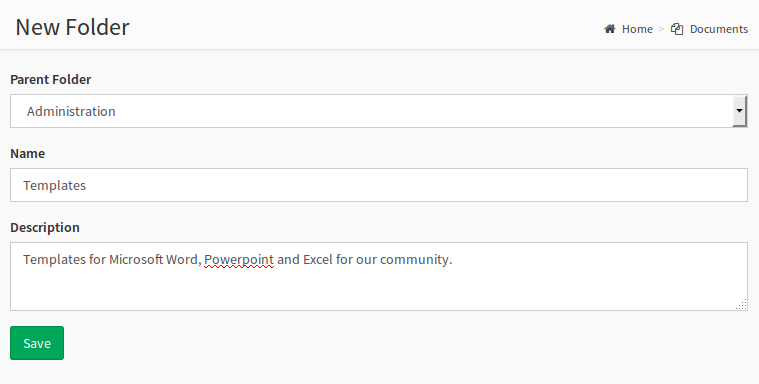
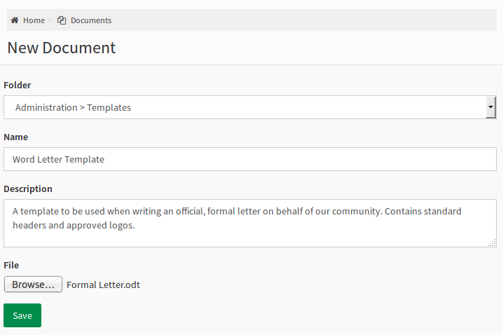
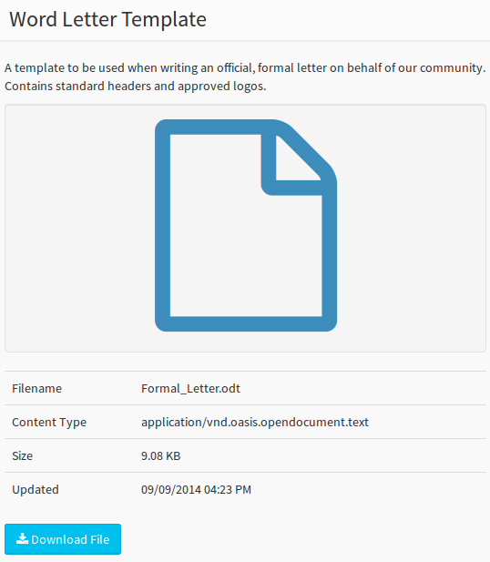
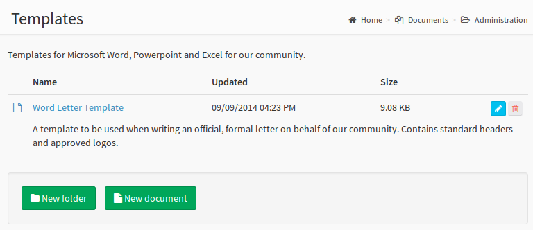

# Documents

You can provide documents for download by members of your community.  You can use this function to share sermon notes, study questions, administrative templates, pdf's - any sort of document you can think of!

>  **Note** In order to upload documents, a member must have the *Manage Documents* permission.

Documents can be stored in a nested folder structure. Simply select the parent folder for your new folder when you create it.

> <small>  Note: You won't see the Parent Folder option on the first folder you create.</small>

#### Uploading Documents

Uploading documents is as simple as:

1. Selecting the **New Document** button
2. Choosing a folder (leave blank for the top level)
3. Giving the document a name and description
4. Selecting the file, and saving.

> **info** The maximum file size is 25 MB.

> **Success** A successful upload will create a new document page.

#### Editing Folders

If you need to edit the folder, name or description associated with the file, you can used the blue edit pencil to access the document properties page and make your changes.

> **Danger** The trash can will delete the document. You have been warned!

---
