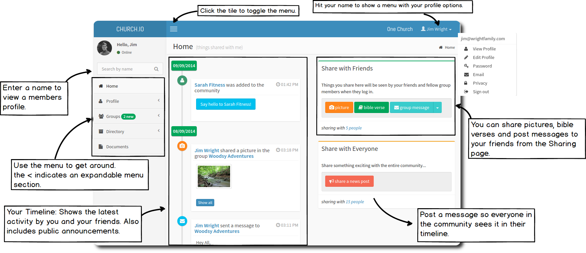
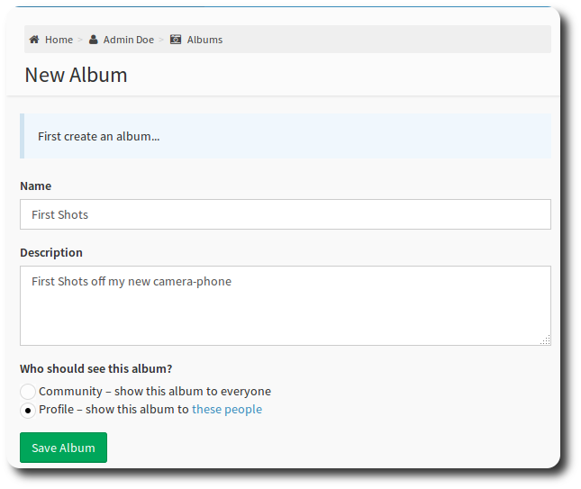
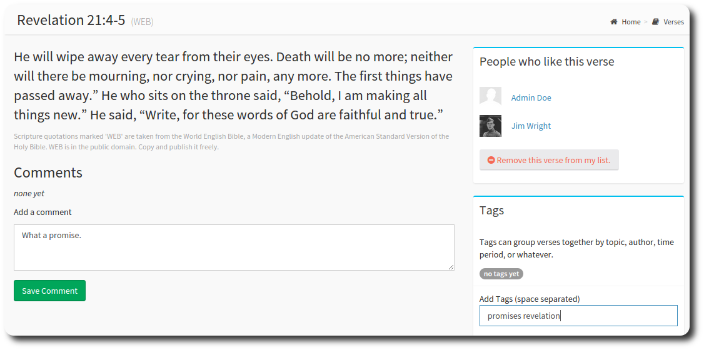

# Getting Started

When you first sign in to OneBody, you'll see the homepage, which shows the current activity for you and your friends.

<small> [Help! I can't sign in.](../getting_started/logging_in.html) </small>

From the homepage you can share pictures, bible verses and post group messages.

### Sharing Pictures
To share a picture, first you need to create an album. You can choose to share the album with the community, or just your friends.

Once you have saved the album, **Select Photo** will upload more. Its that easy.

### Sharing Bible Verses
Hit the Bible Verse icon to share a verse. You'll be prompted to add your verse, then you'll see:

You can also add a comment to the verse, and your friends can comment as well.

### About Friends
Friends are members of the community that you know and would like to share more of your journey with. To make new friends, lookup the members profile, and send them a friend request. They will recieve an email to confirm your friendship.

Some notes about friends:

* Your friends activity will appear on your timeline, and vice versa.
* You're automatically friends with anyone in your groups.

---
### What's next?
1. Check your [profile](../people/README.html) is complete.
2. Concerned about privacy? So are we. Set your [privacy](../people/README.html#setting-privacy-options) options to control visibility.
3. Join a [group](../groups/README.html#joining-a-group)

---

