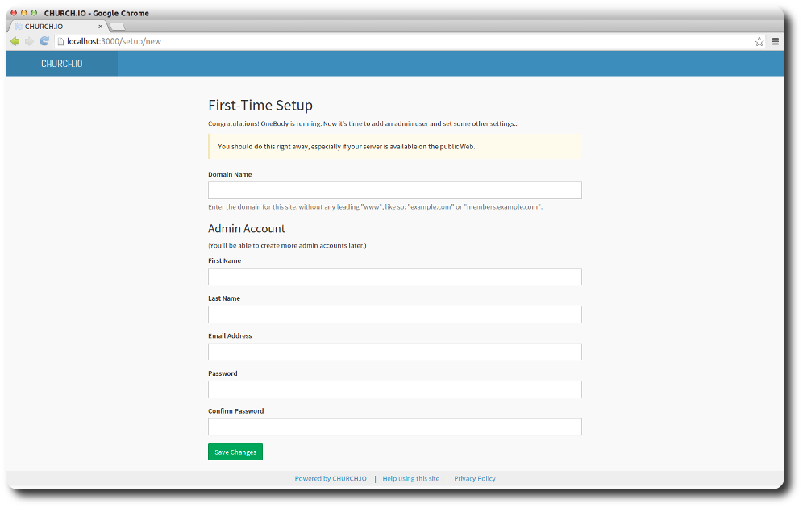

# Getting Started - For Administrators

> We've assumed you have installed OneBody by this point and you're interested in setting it up for your church.

OneBody is a complex system, and there are a number of configuration options. This guide aims to get you started with some minimal setup. The [Admin Dashboard](../administration/README.html) section covers more advanced options.

In this getting started guide, we'll cover:

-  [First Time Setup](#first-time-setup)
-  [The Admin Dashboard](../administration/README.html)
-  [Updating your site contact details](../administration/settings.html#contact-tab)

#####First Time Setup
The first time you fire up OneBody, you'll be asked to configure your domain, and add an admin account. This account will be used to configure your administrative settings, which we'll cover in more detail in later pages.

Field | Description
------------ | -------------
**Domain Name**    |  Enter your domain name, without any leading http://www, like so: "example.com" or "members.mychurch.com"
**Admin Account**  |  Enter your admin account details and save.

Next:

* Head over to the [admin dashboard](../administration/README.html#the-admin-dashboard) to familiarise yourself with the interface.
* Configure your email and contact settings by heading to the [contact section](../administration/settings.html#contact-tab).
* Make sure all the [features](../administration/settings.html#features) are enabled.

Optionally:
* [Set up additional administrators](../administration/managing_admins.html)
* [Import a file of People](../administration/import_&_export.html#import)
* [Create Groups](../groups/README.html)
* [Create a document structure](../documents/README.html)

> **success** Thats it!

