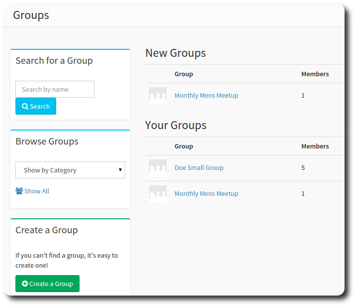

# Groups

Groups are a convenient, logical way to organise people in your church. You can have groups for many purposes - home groups,  mens and womens meetings, prayer, leadership, sunday service organisation (e.g. ushering, communion, kids church volunteers) - in fact, just about anything you can think of!

With OneBody Groups, you can:

* Create a prayer request
* Share pictures
* Send email to all participants in the group
* Track Attendance in the group

You can also report on group activity through the Reporting Dashboard.

The Groups landing page is your starting point for interacting with groups. From here you can find a group (if your church has many), browse a listing of groups, and view the groups you belong to.

## Joining a group
From the groups landing page, select the group name you would like to join, select the Join Group icon, and you're done!

>**info** You'll be notified if your selected group requires administrator approval to join.

Can't find a group you like? [Create one!](../groups/creating_a_group.html)

