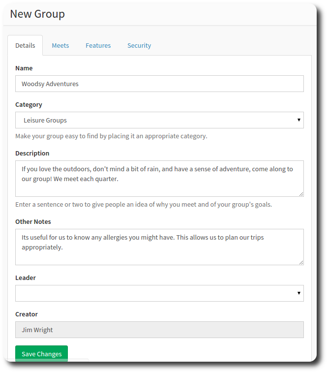
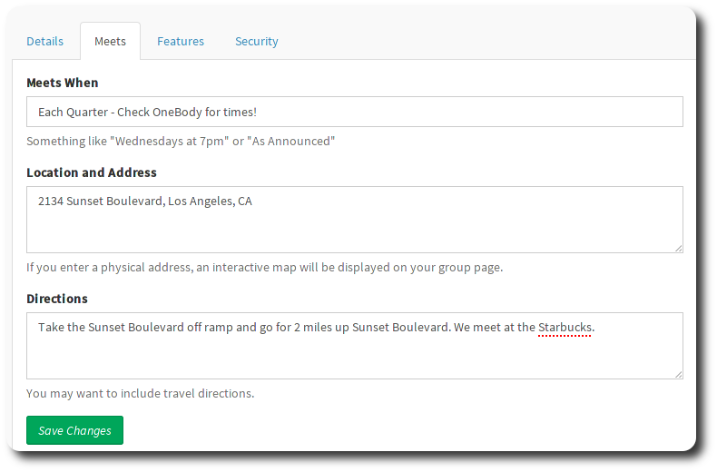
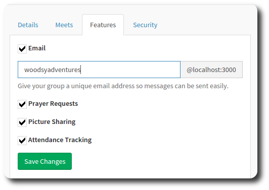
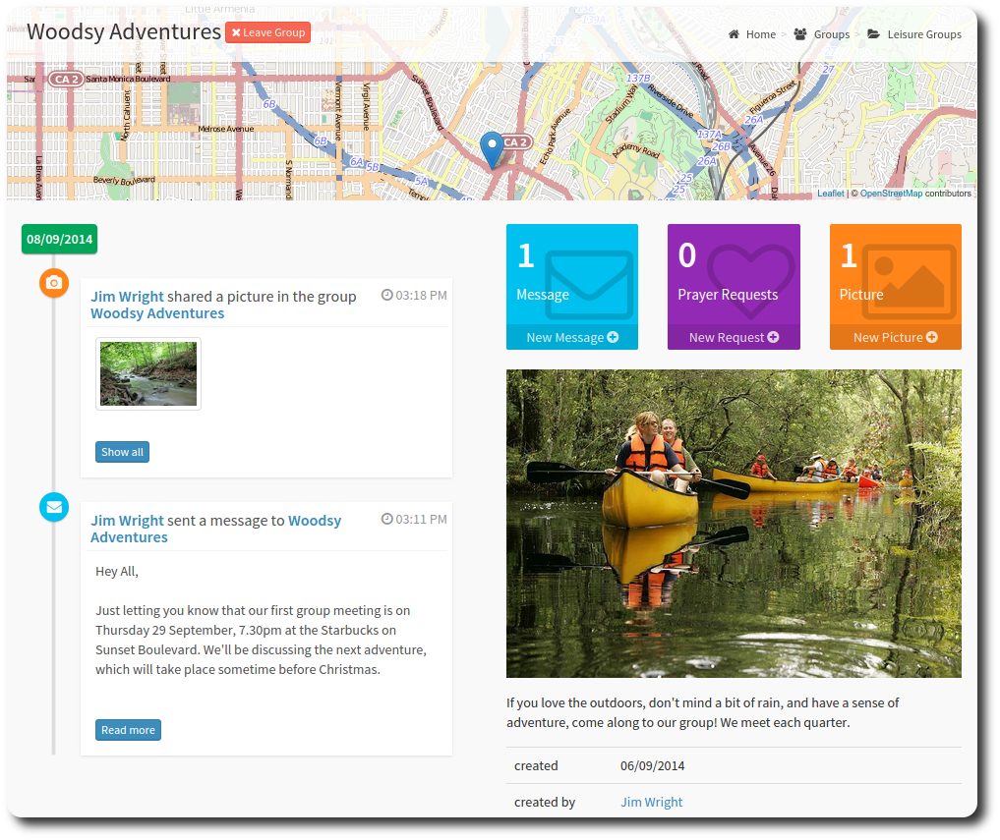

# Creating a Group

If you can't find a group, then you can always create one!

All groups require approval from a super administrator before they can accept members. This allows a degree of control over groups that are created and prevents inappropriate groups in your community.

There are four tabs you can complete to create your group.

The Details tab records basic data about your group:

>**Info** Look for a broad category to put your group in.

If you create the group, you automatically become an adminstrator for the group.

The Meets tab to let others know about where the group gathers:

> **Success** Entering a physical address causes a streetmap to be displayed on your group.

The street map is displayed through Geocoding. Geocoding works out a precise location based on an address entered by a person.

Because computer speak <> human words, you might have to enter the address differently than you would normally, to get the correct result.

Example: Your address consists of five elements:
1. Line 1
2. Line 2  <<
3. Suburb  <<
4. City  <<
5. Postcode <<
5. Country

You may have to try different combinations of Line 2, Suburb City and Postcode in order for the geocoding service to recognise the address. Try removing some of the elements for the address to see if that improves the accuracy.

> Its usually not neccesscary to modify Line 1 or Country.

The features tab controls which OneBody features you want to implement for your group.

**Email** will allow emails to be sent to and from your group email address. You can also share pictures and record attendance for your particular group.

Groups also come with security enabled. The security tab holds three settings:

1. **Approval Required to Join** - An administrator must approve all new signups to the group.
2. **Private Group** - A private group hides the group details (description, membership list) from non-members.
3. **Group Members can Post Messages** - Allows members to send a message to all other members in the group.

You can also share files with the group by uploading them.

That's it! You can now post messages, share pictures, and track attendance for your groups!

If you're a group leader, you might want to head on over to [Looking after Groups](../administration/looking_after_groups.html).

