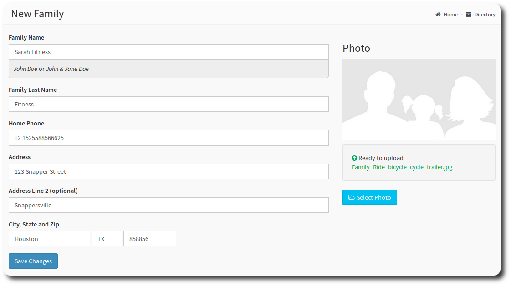
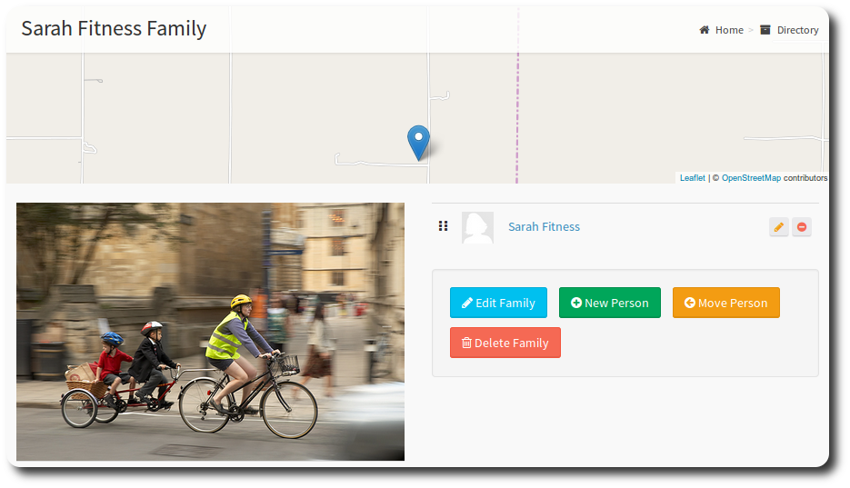
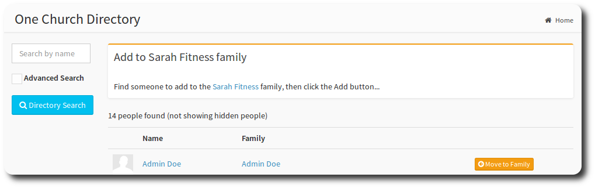

# Families

As well as individual member data, OneBody also features family grouping. Many features of OneBody make use of the family unit; Attendance, Check-in, Online Directory, and visibilty are just examples.

A family in the OneBody sense is a household, or all people living at one address that share the same family roof. As examples:

* An individual
* Two individuals
* A married couple
* Parent(s) and child(ren)
* Parents, children and extended family

## Adding a New Family

>**Comment** You need to be an Administrator to add a new family.

1. From the Directory Menu, select Add Family.
2. Fill in the family details:

After saving, you can then add more details for the family:

You can then add a new person or move an existing person into the family. **Adding a person** to family follows the same process as [adding a person](../administration/looking_after_people.html#adding-people-manually).

> <small> Edit Family will take you back to the family details page.</small>

To **move a person** into a family, follow these steps:
1. Select the **Directory** option from the menu.
2. Locate the family that you'd like to move.
3. From the families page, select **Move Person**.

Select **Move to Family**. You will be prompted to confirm.

> **note** Moving a person changes *family* details, (eg. address and phone number), but not individual details, like last name.

> **Danger** Delete Family Does what it says, but it won't delete the members of the family.

---
     Link to add a person
     Sort out add new person navigation (changed by #235)

