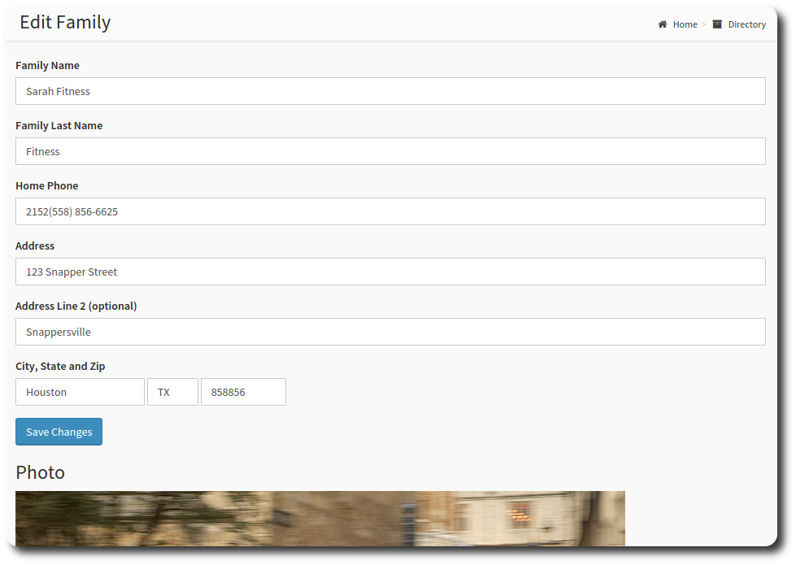

# Families

As well as individual member data, OneBody also features family grouping. Many features of OneBody make use of the family unit; Attendance, Check-in, Online Directory, and visibilty are just examples.

A family in the OneBody sense is a household, or all people living at one address that share the same family roof. As examples:

* An individual
* Two individuals
* A married couple
* Parent(s) and child(ren)
* Parents, children and extended family

## Looking after Families

When you [add a new person](../administration/looking_after_people.html#adding-people-manually), you also add a new *family* record.

To add more detail to a family, navigate to the directory to find the family you are looking for. Click the family name link to access more details for the family:

You can then [add a new person](../administration/looking_after_people.html#adding-people-manually), edit family details, or move an existing person into the family.

####Editing a family

You can edit basic details about a family group, to save multiple entry for all the members of your family.

####Move a Person

To move a person into a family, follow these steps:
1. Select the **Directory** option from the menu.
2. Locate the family that you'd like to move.
3. From the families page, select **Move Person**.

Select **Move to Family**. You will be prompted to confirm.

> **note** Moving a person changes *family* details, (eg. address and phone number), but not individual details, like last name.

> **Danger** Delete Family Does what it says, but it won't delete the members of the family.

---

