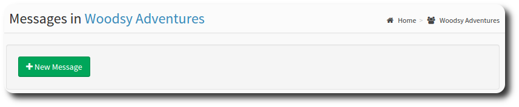
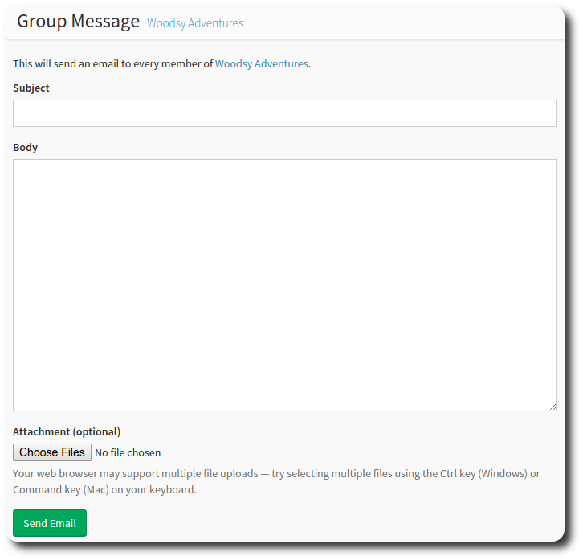

# Posting Messages

You can use the group message function to send an email to all members of the group, without knowing everyone's email address.

Select the *Messages* metric, and hit New Message to create your messsage.

The new message screen appears. Give your message a subject and body (just like an email), attach any files, and hit send email!

---

