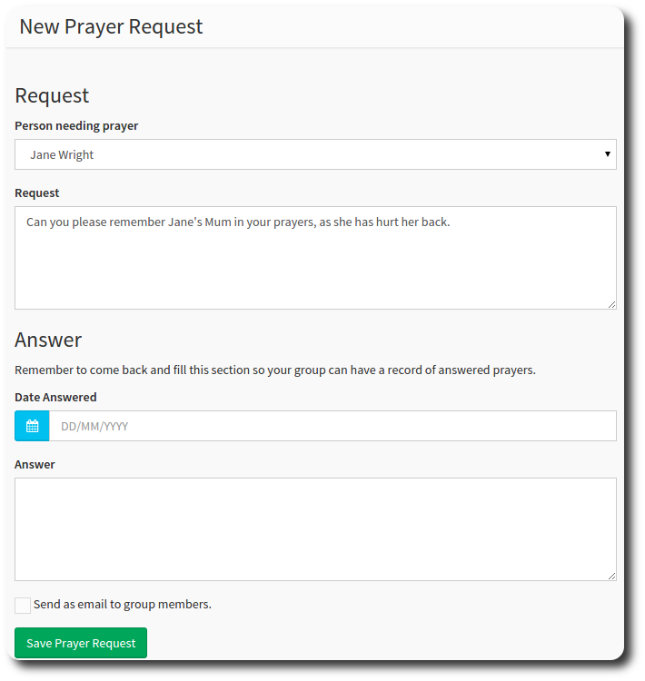

# Prayer Requests

You can use the group prayer request for situations where you (or someone in your group) needs prayer.

Select the *Prayer Request* metric, and hit New Prayer Request to create your messsage.

Selecting *send as email* will also email all the members of your group with the request.

You can also come back later and record any answers you have recieved.

----
