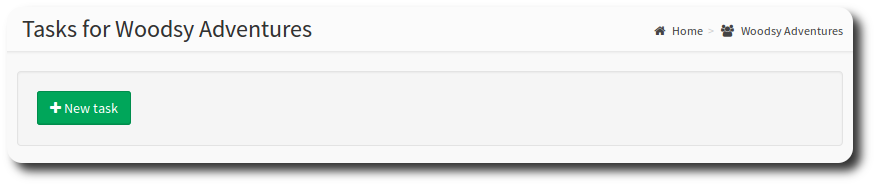
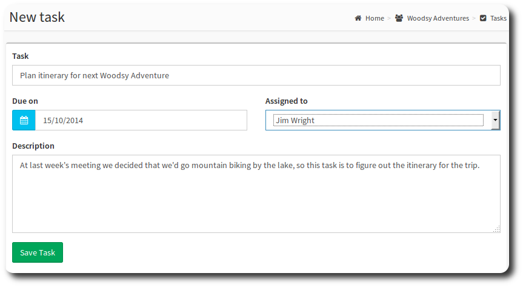
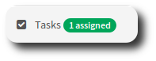
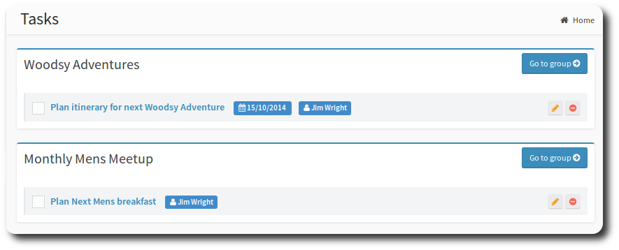
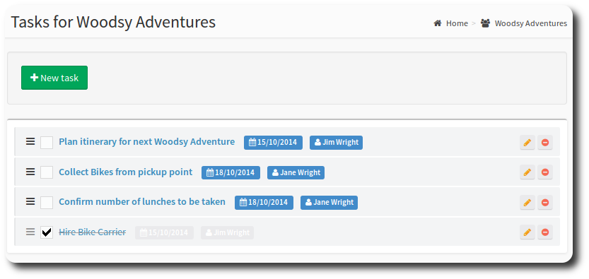
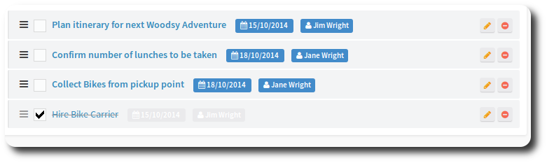
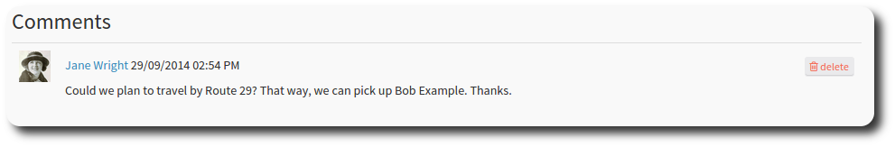
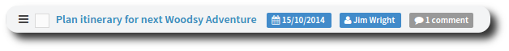

# Tasks

You can use OneBody groups to manage tasks that your members have to complete.

> **hint** Activate Group Tasks on the [Groups Setup](../groups/creating_a_group.html#features) page.

Select the Tasks metric to access the tasks page, and hit New Task to create your first task.

You'll see the new task screen. Each task has a name, and optionally, can record a due date, assignee and description. The assignee needs to be a member of the group. Anyone in the group can add a new task.

Fill out the task details and hit Save Task to complete.

#### Viewing Tasks

If you have Tasks assigned to you, you'll see them on the sidebar.

Hit the Tasks menu option to view a list of tasks assigned to you, by group.

#### Administering Tasks

Selecting the task metric on hte groups launching page will take you to a list of tasks for the group.

If you need to edit the task, choose the pencil icon next to the task you want to action. The Delete button will remove the task.

You can complete a task by selecting the the check box next to the task. The completed task will grey out.

Sort Tasks by dragging the tile next to the task name. In this example, we've promoted the "confirm number of lunches to be taken" task above the "Collect Bikes from pickup point" task.

If you would like to comment on the task, you can do so by selecting the task name. You can comment on any of your groups' tasks.

The task will also recieve a comment tag.

---
