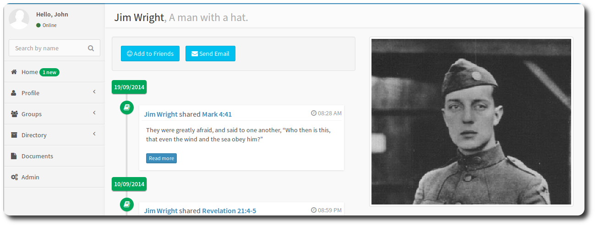
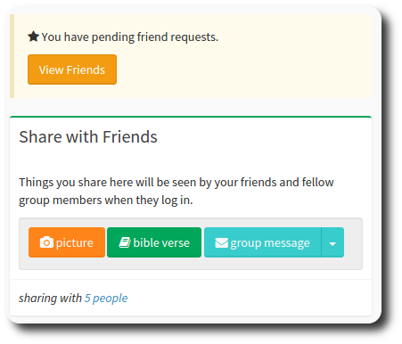
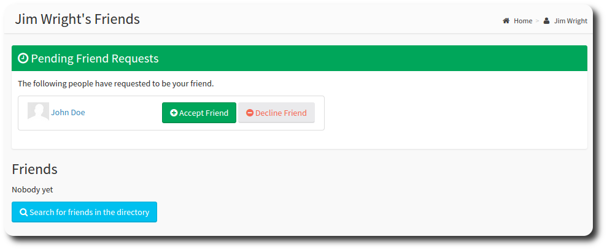
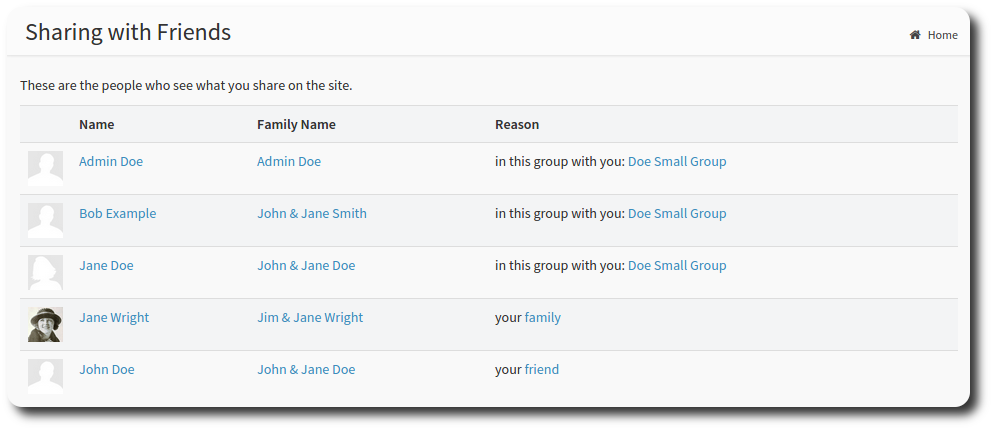

# Friends

As we said in our welcome, OneBody is all about connection to others in your faith community. OneBody friendships can help build that connecting bridge.

Friends are members of the community that you know and would like to share more of your journey with. To make new friends, lookup the members profile in the [directory](/directories/README.html), and send them a friend request.

In this example, John has searched for Jim in the directory. John would click the **Add to Friends** button to send Jim a friend request. Jim will recieve an email to his OneBody email address asking him to confirm the friendship.

Meanwhile, Jim will be a *pending* friend for John:

As well as the email, next time Jim accessess OneBody, he'll have a pending friend request on his homepage.

Hitting the **View Friends** button will take you to the friends page.

To accept, simply click "Accept". The person will then be added
to your friends list.

> **info** When you decline a request, that person can't send you another friend request.

To view your friends list, select the **Sharing with People** Link in the *Sharing with friends* box on the homepage.

* Your friends' activity will appear on your timeline, and vice versa.
* You're automatically friends with anyone in your groups or family.

---
