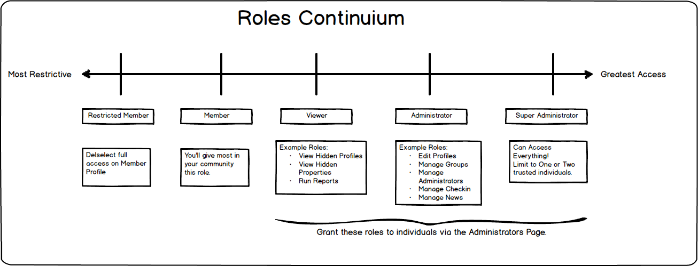

# Understanding Security

> **Comment** OK. Not the most exciting topic. But its needed to keep your community safe and secure.

## Application Security

Within OneBody, you can configure different levels of access (known as roles) to allow members to perform their duties in the community.

The most restrictive role is that of a limited access member, and the most open that of a Super Administrator. The following diagram illustrates the effect of granting specific roles to your members, and some of their characteristics.

## Understanding Member Accounts

OneBody accounts are secured by a unique log-in using each members' personal email address. Passwords are five characters minimum.

At implementation, you can choose different strategies for creating member records (and therefore accounts).

**Preload your Member Database**
You can pre-load your entire membership database into OneBody so that it is pre-populated. All members then have to do is verify their identity using their supplied email address.

**Member Self Signup**
Under this scenario, members can sign themselves up for an account. The account can then be automatically created or you can require approval before the signup is enabled.

**Use Social Media**
> Coming Soon: Use various social media providers (e.g. Twitter) to sign in to OneBody.

Under all of these strategies you can choose to allow or prevent self signups on an ongoing basis by using the sign up flag on the Members page. You can also choose to set an approval email address so you can review signups before allowing login. If this email is blank then the signup will be automatically approved.
